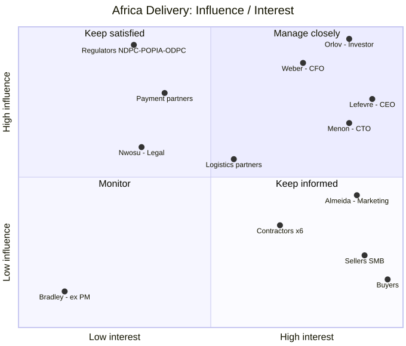

# Stakeholder Matrix

## Чей голос решающий

1. **Закон стоит выше всех.** NDPR/NDPA, POPIA, KICA и Kenya DPA 2019 не отменяются ни деньгами, ни связями (A3, п. 1-3). Инвестор сам поставил это условием успеха: A1 «…не звонит министр с вопросом, почему нигерийские данные лежат на сервере во Франкфурте», A7 «данные остаются в стране (министр!!)».
2. **К. Орлов - единственный акционер и финальное слово** по сроку, деньгам и допустимому риску (A1, A7). При этом он сам делегировал полномочия:
   - бюджет - CFO: A1 «с Анной не спорь»;
   - технологии - CTO и архитектору вместе: A1 «Раджеш, сами договоритесь. Технологии - твоя зона».

   Выносить ему нужно одну страницу и готовое решение с вариантами, а не проблему: A1 «Возвращайся с решением, а не с проблемой».
3. **А. Вебер (CFO) фактически имеет право вето на архитектуру.** Это делегировано инвестором (A1). Она подписывает каждую позицию дороже $500 в месяц (A6, п. 2) и прямо пишет, что если людей не хватает, то неверна архитектура, а не бюджет (A6, п. 5).
4. **М. Лефевр (CEO) - владелец scope первого релиза.** PM ушёл 04.08 (A4), а CEO сам поднял вопрос разделения релизов (A1).
5. **Р. Менон (CTO) - соавтор технических решений**, но только в рамках ограничений 1-3. Его письмо A5 не является требованием бизнеса.

## Матрица

Влияние и интерес - по шкале 1-5. Приоритет в конфликте: 0 - непреложно, далее по убыванию.

| Стейкхолдер | Ключевые интересы (источник) | Влияние | Интерес | Приоритет в конфликте | Предпочтительная коммуникация |
|-|-|-|-|-|-|
| Регуляторы: NDPC (Нигерия), Information Regulator (ЮАР), ODPC и CA (Кения) | Локализация ПДн, регистрация и DPO, подтверждаемое согласие, блокировка контента (A3, п. 1-3) | 5 | 2 | **0**: ограничение, а не мнение | Только через юриста, формально. Ранний контакт с NDPC (A3, п. 1) |
| К. Орлов, инвестор и единственный акционер | Запуск 15.10, «не падает», «максимально дёшево», данные в стране, выплаты продавцам в тот же день, 40 % рынка за 3 года (A1, A7) | 5 | 5 | **1** | Одна страница на английском до четверга 13.08 (A1). Решение плюс 2-3 варианта с ценой. Лично на встрече в Найроби |
| А. Вебер, CFO | $5 000 в месяц на всё техническое, без предоплат, 6 контракторов, платёжные издержки ≤ 2,5 % GMV, без лицензионного ПО, runway 9 месяцев (A6, п. 1-7) | 5 | 4 | **2**: вето, делегированное инвестором | Письменно и заранее: стоимость заказа, TCO на 5 лет, «цена ошибки», КП с названной альтернативой (A6) |
| М. Лефевр, CEO (ранее в Jumia) | Реалистичный запуск, чёткое разделение релизов (A1: «В Jumia запуск такого масштаба занимал год») | 4 | 5 | **3**: scope и последовательность релизов | Продуктовый синк, roadmap по релизам. Его опыт в Jumia - источник рыночных фактов |
| Р. Менон, CTO | 10 млн пользователей с первого дня, CNCF, Istio, Kafka, 40-50 сервисов, без managed-сервисов, Oracle, Go, своя логистика, 99,99 % и RPO = 0 (A5) | 4 | 5 | **4**: техрешения внутри приоритетов 0-3 | Один на один до Найроби: черновик ADR (просил сам, A5). Аргументы - цифры, PoC, бюджет |
| С. Алмейда, Head of Marketing | 7 обещаний «изменить нельзя», $180 000 невозвратно, листинг 01.10, live-стрим 17.10, SMS по купленной базе (A2) | 3 | 5 | **5**: обещания подчиняются закону (A3, п. 2) и бюджету | Через CEO: какие обещания платформа выполняет в день запуска и чем закрываются остальные |
| А. Нвосу, внешний юрист (Лагос) | Предварительность заключений, ограничение ответственности (A3) | 3 | 2 | **0** - транслирует требования закона (A3) | Письменно, одним пакетом конкретных вопросов: работает с почасовой оплатой (A3) |
| Платёжные партнёры: M-Pesa, Flutterwave, Paystack | Работа через их лицензию, KYC, SLA (A3, п. 4) | 4 | 2 | **0** - лицензионные требования (A3, п. 4); 6 - тарифы и SLA | Через CEO: договор, sandbox, SLA, тарифы под лимит 2,5 % (A6, п. 6) |
| Логистика: Sendbox, Sendy | Объём отправлений (A4, заметки; K) | 3 | 3 | 6 | Договор, API, SLA доставки под обещание 2 (A2) |
| 6 контракторов (вся команда до декабря) | Реализуемый объём, понятный стек (A6, п. 5) | 2 | 4 | 6 | Ежедневно. Их ёмкость - главный ограничитель scope |
| Продавцы МСБ (WhatsApp, Instagram, USSD) | Деньги в тот же день, простой онбординг (A1, A2, A4 #8-9) | 2 | 5 | 7: представлены через CEO | Пилотная группа 10-15 продавцов в Лагосе (A1, предложение архитектора) |
| Покупатели (Android < $150, дорогой трафик, сельские - USSD) | Доверие, цена, экономия трафика (A2) | 2 | 5 | 7: представлены через CEO и маркетинг | Аналитика продукта, полевые интервью |
| Т. Брэдли, бывший PM | Ушёл 04.08. Остался список A4 «всё P0» | 1 | 1 | Не участвует | - |

У юриста и платёжных партнёров приоритет 0 - только в части требований закона и лицензирования (A3): эти условия не обсуждаются. Коммерческие условия партнёров (тарифы, SLA) имеют обычный приоритет 6 и являются предметом переговоров - например, комиссии под лимит 2,5 % GMV (A6, п. 6).

## Диаграмма «Влияние / интерес»

Исходник: [diagrams/influence-interest.mmd](diagrams/influence-interest.mmd).

Как работать с квадрантами:

- **Manage closely** - Орлов, Вебер, Лефевр, Менон. Любое решение с ценой проходит через них.
- **Keep satisfied** - регуляторы и платёжные партнёры. Их требования встраиваются как ограничения, а не как фичи.
- **Keep informed** (маркетинг - на границе с Manage closely из-за неизменяемых обещаний) - маркетинг, продавцы, покупатели, команда. У покупателей и продавцов нет голоса внутри компании: локальных сотрудников нет (K). Этот риск закрывается пилотной группой продавцов.
- **Monitor** - бывший PM. Его список A4 - входные данные, а не обязательства.

## Assumptions

- «Совет директоров» в A3 и A5 - это фактически Орлов как единственный акционер.
- До найма нового PM владельцем scope считается CEO, а не CTO и не инвестор.
- Связи инвестора в министерстве (A1) не заменяют регистрацию в NDPC и выполнение NDPA (A3, п. 1). Приоритет 0 у регуляторов сохраняется.
- Возможные ограничения CEO по non-compete с Jumia в этом документе не анализируются.
