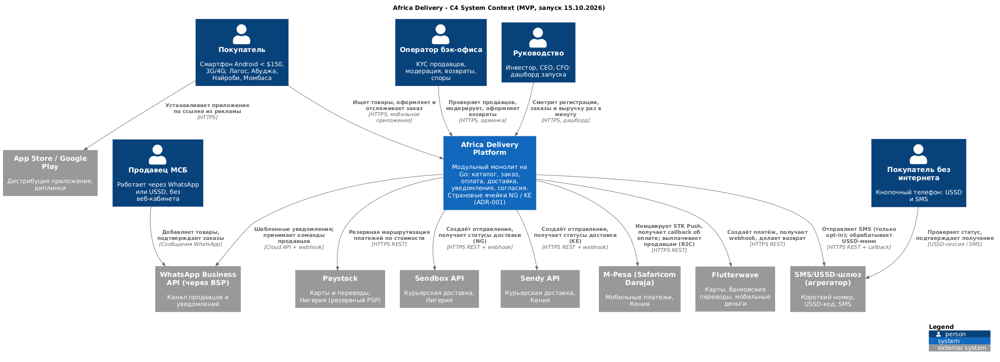

# Architecture Vision: Africa Delivery

Версия 0.9, 17.08.2026, к встрече в Найроби. Структура соответствует TOGAF ADM Phase A.

## 1. Бизнес-контекст и проблема

Africa Delivery - мультикатегорийный маркетплейс с низкой ценой и ставкой на объём. Запуск в Нигерии и Кении 15.10.2026, затем ЮАР и до 15 стран за 3 года, цель - 40 % рынка (A1, A7). Рекламная кампания на $180 000 оплачена и невозвратна (A2), поэтому дата неподвижна. Компания живёт с runway 9 месяцев, командой из 6 контракторов и облачным бюджетом $5 000/мес (A6). Проблема архитектуры - не «как построить Amazon» (A1), а **как запустить надёжный путь «купил -> оплатил -> получил -> продавец получил деньги» в эти сроки и деньги, не закрыв дорогу к масштабу**.

## 2. Цели и критерии успеха

Критерий успеха задан инвестором: «Люди покупают. Продавцы получают деньги. Ничего не ломается. Министр не звонит про данные» (A1).

| Цель | Измеримый критерий |
|-|-|
| Запуск в срок | Приложения в сторах 01.10, кампания 15.10 |
| Люди покупают | Доля успешных оплат >= 95 %, p95 «до первого товара» на 3G <= 2 с (A2) |
| Продавцы получают деньги | Выплата в день подтверждённой доставки, с резервом на возвраты (C-09) |
| Ничего не ломается | 99,9 % для заказа и оплаты на запуске, ноль потерянных заказов и платежей |
| Данные в стране | Ноль ПДн нигерийцев и кенийцев вне страны (A3, A7) |
| Экономика | Облако + SaaS <= $5 000/мес, стоимость заказа в Год 1 <= $2,3, платёжные издержки <= 2,5 % GMV (A6) |

## 3. Стейкхолдеры и их главные заботы

| Кто | Забота | Чем отвечает архитектура |
|-|-|-|
| К. Орлов | Дата, «не падает», данные в стране, дёшево | Модульный монолит успевает к дате. Страновые ячейки. SLO с путём к 99,99 % по триггеру |
| А. Вебер | $5 000/мес, 6 человек, без лицензий, стоимость заказа, цена ошибки | $4 750/мес, 6 человек, только OSS и managed-сервисы с открытым протоколом. Заказ $2,28 -> $1,36. Цена ошибки $0,88 млн против $0,18 млн |
| Р. Менон | Масштаб, cloud native, без lock-in, Go | Go, Certified Kubernetes, GitOps, OTel. A5 - целевое состояние с триггерами |
| М. Лефевр | Чёткое разделение релизов | Scope ниже, roadmap в разделе 8 |
| С. Алмейда | Обещания кампании | Каждое обещание в scope, операционный обход или явный перенос |
| Регуляторы | NDPA, POPIA, KDPA | Резидентность, согласия, аудит-лог (ADR-003) |

Подробно - в [stakeholder-matrix](../Task1/stakeholder-matrix.md).

## 4. Scope первого релиза

Принцип взят у инвестора: «всё, к чему прикасается покупатель» (A1), плюс минимальный бэк-офис, без которого не работают значок «проверено» и возвраты (C-11).

- **Входит:** каталог (5 000 SKU, 100 продавцов) с поиском на EN/FR; Android-приложение и iOS из одной кодовой базы с офлайн-кешем; заказ; оплата через M-Pesa, Flutterwave (карта, перевод) и Paystack как резерв; наличные курьеру только в Лагосе и Найроби; отслеживание по статусам партнёров; уведомления SMS, WhatsApp и push только по opt-in; онбординг продавца через WhatsApp; USSD для статуса и подтверждения получения; возврат кредитом на баланс; минимальный бэк-офис (KYC, модерация, возвраты); дашборд запуска с обновлением раз в минуту. Сценарии - в [use-cases.png](use-cases.png).
- **Не входит (Год 1):** кабинет продавца с аналитикой, track & trace на карте, видеофиксация в ПВЗ (сначала юридическая проверка, A4), B2B, ML-антифрод (на запуске - правила), языки суахили, хауса и йоруба, PWA с паритетом, публичный GraphQL API.
- **Отклонено:** рассрочка со своим скорингом и P2P-кошелёк (нужны лицензии, C-06), парсинг цен Jumia (правовой риск), SMS по купленной базе (C-08).

## 5. Архитектурные принципы

1. **Сначала дата и деньги, потом элегантность.** Решение, не проходящее A6, - не решение (A6, п. 5).
2. **Late binding.** Откладываем необратимые решения до измеримого триггера, но заранее готовим для них границы.
3. **Данные живут в стране субъекта.** Размещение - конфигурация ячейки, а не код (C-07).
4. **Партнёр там, где лицензия или чужая сеть.** Платежи, логистика, мессенджеры - через порты-адаптеры (C-05, C-06).
5. **Переносимость по протоколу.** Только открытые интерфейсы: PostgreSQL, S3, Kafka API, OTel (C-03).
6. **Деньги не теряются.** Идемпотентность, outbox, сверка с PSP, деградация вместо отказа.
7. **Лёгкий клиент.** Каждый мегабайт стоит покупателю денег (A2).

## 6. Целевая архитектура

Источник: [c4-context.puml](c4-context.puml).

| Решение | Суть | ADR |
|-|-|-|
| Стиль | Модульный монолит на Go: 8 модулей с границами, outbox-события | [ADR-001](adr-001-architecture-style.md) |
| Данные | Страновые ячейки NG и KE на локальных площадках. Каталог и обезличенные данные в общем облаке | ADR-003 (задание 4) |
| Доступность | Мультизонно 99,9 %, RPO ≈ 0 внутри ячейки. Управляемая деградация: заказ принимается при сбое PSP, оплата дожимается позже | [Стратегия доступности](../Task3/availability-strategy.md), [ADR-002](../Task3/adr-002-caching-strategy.md) (кеширование) |
| Build / Buy / Partner | Свой код только для ядра. Платежи и логистика - partner. Админка - OSS | [ADR-004](../Task5/adr-004-payment-provider.md) (платежи), [capability-map](../Task5/capability-map.md) |

Переход **baseline -> target**: baseline отсутствует (greenfield). Target на Год 1 - вариант A. Target на Годы 2-3 - сервисная архитектура (вариант B) за счёт выноса модулей по триггерам. Направление на Годы 3-5 - элементы A5 (Kafka, mesh, мультирегион) по экономическим триггерам.

## 7. Чего мы не делаем и до какого момента

| Не делаем | До | Триггер |
|-|-|-|
| Микросервисы, Istio | Год 2 | MAU > 1,5 млн или команда > 12 человек |
| Kafka | Год 2 | > 500 событий/с или > 3 потребителей потока |
| 99,95 % / 99,99 % для оплаты | Год 2 / Год 3-4 | GMV >= $37 млн / >= $142 млн в год ([расчёт](../Task3/availability-strategy.md)) |
| Своя логистика | Год 2 | Сборы партнёров > 3 % GMV |
| Oracle | - | Только доказанное узкое место PostgreSQL и согласие CFO |
| Блокчейн-лояльность (A1, A5) | После Года 1 | Отдельное исследование на 2 недели: юридический статус токенов, стоимость, спрос |
| Финальное размещение ПДн | Заключение юриста, 05-19.09 | Проектируем под самое строгое прочтение, меняется только конфигурация |

## 8. Дорожная карта

| Период | Результат |
|-|-|
| 18.08-06.09 | Ядро: каталог, заказ, оплата M-Pesa и Flutterwave, ячейки NG и KE, CI/CD |
| 07.09-24.09 | Доставка (Sendbox, Sendy), уведомления, WhatsApp-онбординг, бэк-офис, нагрузочный тест ×10 |
| 24.09-01.10 | Ревью в сторах, листинг. Пилот с 10-15 продавцами в Лагосе |
| 15.10 | Запуск. 17.10 - live-стрим через внешний сервис видео |
| Год 1 | 5 стран, кабинет продавца, track & trace, возвраты, антифрод, языки, B2B |

## 9. Ключевые риски

Срок ревью в сторах. Заключение юриста может прийти за 4 недели до запуска. Ожидания инвестора о 99,99 % на запуске. Зависимость от SLA партнёров. Нет людей с локального рынка. Полный список - в [architecture-canvas](../Task1/architecture-canvas.md).

## Assumptions

- Встреча в Найроби - 18.08.2026. Решения ADR-002…004 принимаются в заданиях 3-5 (кеширование, резидентность, build/buy/partner) по единому [шаблону](../adr-template.md).
- Драйверы бизнеса (400 тыс. -> 6 млн пользователей) - базовый сценарий модели TCO, а не обещание рекламы «1 млн в первый месяц» (C-12).
