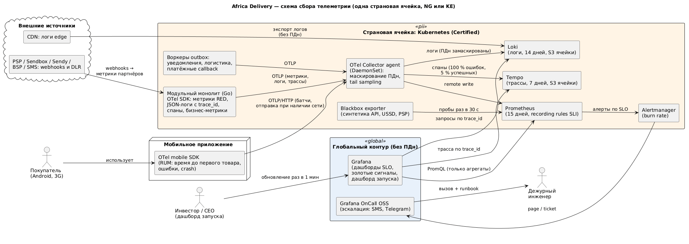

# Стратегия наблюдаемости

Цель — чтобы дежурный за минуту понимал, **нарушается ли обещание покупателю** и **кто виноват: мы или партнёр**. Поэтому наблюдаемость строится от SLO ([slo/](slo/)), а не от списка инструментов. Источники: A5 (стек OTel, Prometheus, Grafana, Loki), A2 (дашборд запуска с обновлением раз в минуту), NFR-20, NFR-29.

## 1. Схема сбора

Источник: [observability.puml](observability.puml).

- Всё приложение инструментировано **OpenTelemetry SDK** (Go и мобильный клиент) — единый протокол OTLP, без вендорских агентов (NFR-19).
- **OTel Collector** в каждой ячейке маскирует ПДн (телефон, имя, адрес, номер кошелька) до записи. Хранилища телеметрии живут **внутри страновой ячейки** (NFR-22, C-07). В глобальный Grafana уходят только агрегированные метрики и запросы по trace_id к уже замаскированным данным.
- Партнёры наблюдаются **с нашей стороны**: на каждый вызов PSP, логистики и мессенджера есть спан и метрика `partner_requests_total{partner, country, outcome}`. Плюс синтетические пробы sandbox-эндпоинтов. Так отказ M-Pesa отличается от нашего.

## 2. Четыре золотых сигнала по сервисам

| Сервис | Latency | Traffic | Errors | Saturation |
|-|-|-|-|-|
| **Каталог** | `http_server_duration_seconds{module="catalog"}` p95/p99; RUM `app_first_product_seconds` p75 | RPS origin и edge; доля попаданий CDN `cdn_cache_hit_ratio` | 5xx origin, 5xx edge после stale | CPU и память deployment `catalog-read`, пул соединений к реплике, `valkey_memory_used_ratio` |
| **Заказ и оплата** | p99 `POST /v1/orders`; `payment_finalized_seconds` (callback → финальный статус) | Заказы в минуту, платежи по PSP и стране | 5xx заказа; `payment_failed_total{reason}`; **`reconciliation_mismatch_total`** | Пул БД primary, `outbox_lag_seconds`, число pending-платежей старше 5 мин |
| **Уведомления** | `notification_dispatch_seconds` (событие → передано провайдеру); USSD-ответ ≤ 2 с | Сообщения в минуту по каналу | Отказы провайдера, DLR «не доставлено», `consent_violation_total` | Глубина очереди и возраст старейшего события, dead-letter, лимит агрегатора |
| **Партнёры** (PSP, Sendbox, Sendy, BSP, SMS) | p95 вызова партнёра | Вызовы в минуту | Доля ошибок и таймаутов, состояние circuit breaker | Остаток rate limit партнёра |
| **Инфраструктура ячейки** | Репликационный лаг PostgreSQL | IOPS, сетевой трафик | Рестарты подов, OOM | CPU, память и диск нод, PVC |

## 3. Связь метрик с SLI и SLO

| SLI ([slo/](slo/)) | Recording rule (Prometheus) | SLO | Алерт |
|-|-|-|-|
| Доступность каталога на edge | `sli:catalog_edge_good:ratio_rate5m` из логов CDN | 99,95 % | Burn rate |
| Задержка каталога p99 | `histogram_quantile(0.99, …{module="catalog"})` | ≤ 800 мс | Тикет при нарушении 30 мин подряд |
| Приём заказа | `sli:order_accept_good:ratio_rate5m` | 99,9 % | Burn rate (page) |
| Целостность денег | `reconciliation_mismatch_total` | 0 | **Page сразу при > 0** |
| Подтверждение оплаты ≤ 60 с | `payment_finalized_seconds_bucket{le="60"}` | 99 % | Burn rate (ticket) |
| Выплата в тот же день | `payout_same_day_total / delivered_total` | 98 % | Отчёт в 20:00 по местному времени, тикет |
| Передача уведомления ≤ 60 с | `notification_dispatch_seconds_bucket{le="60"}` | 99 % | Burn rate (ticket) |
| Соответствие согласию | `consent_violation_total` | 0 | **Page сразу при > 0**, копия DPO |

Алерты по **multi-window burn rate**: page — 14,4× за 1 ч и 5 мин (за час сгорает 2 % месячного бюджета); тикет — 6× за 6 ч и 30 мин. Алерты на CPU и память — только информационные, они не будят дежурного (NFR-29).

## 4. Что считается инцидентом

| Severity | Условие | Реакция |
|-|-|-|
| **SEV1** | Page по burn rate для «Приёма заказа» или «Каталога на edge». Любое расхождение сверки денег. Любое нарушение согласия. Ячейка недоступна | Дежурный ≤ 15 мин, канал инцидента, статус для CEO каждые 30 мин, постмортем ≤ 48 ч |
| **SEV2** | Разомкнут breaker основного PSP или логистики дольше 15 мин (работаем на резерве). Тикет по burn rate | Рабочие часы. Уведомить партнёра. Постмортем при повторе |
| **SEV3** | Деградация одного канала уведомлений, задержка p99 без нарушения SLO | Бэклог |

Каждый page-алерт ссылается на runbook: что проверить, как переключить PSP или канал, как откатить релиз.

## 5. Логи и трассировка

- **Логи:** структурированный JSON. Обязательные поля: `trace_id`, `cell`, `module`, `order_id`, `idempotency_key`, `partner`. ПДн маскируются в Collector (процессор `transform` с регулярными выражениями для телефонов и кошельков). Хранение — Loki на S3 ячейки: 14 дней оперативно, аудит согласий и денег — 1 год отдельным потоком.
- **Трассы:** W3C Trace Context передаётся через HTTP, outbox-события (trace_id сохраняется в событии) и вызовы партнёров. Так одна трасса связывает заказ → платёж → callback → уведомление. **Tail sampling:** 100 % ошибок и запросов > 1 с, 5 % остальных. Хранилище — Tempo на объектном хранилище: дешевле Jaeger с Elasticsearch при том же OTLP. Jaeger UI подключается при желании CTO (A5).
- **RUM и синтетика:** мобильный SDK отправляет «время до первого товара» батчами при наличии сети. Blackbox-пробы из соседней ячейки раз в 30 с проверяют каталог, заказ (тестовый товар), USSD-меню и sandbox PSP.

## 6. Инструменты и стоимость

| Слой | Инструмент | Почему |
|-|-|-|
| Инструментирование | OpenTelemetry SDK (Go, Android, iOS) | Стандарт CNCF, переносимость (A5, NFR-20) |
| Сбор | OTel Collector (DaemonSet + gateway) | Маскирование ПДн, sampling, единая точка |
| Метрики | Prometheus + recording rules SLI, Alertmanager | CNCF graduated |
| Логи | Loki | Дешёвое хранение на S3 |
| Трассы | Tempo | Объектное хранилище, OTLP |
| Визуализация | Grafana: SLO, золотые сигналы, дашборд запуска для инвестора с обновлением раз в минуту (A2) | Одна точка входа |
| Дежурства | Grafana OnCall OSS, SMS и Telegram | Без платного PagerDuty (A6, п. 7) |

Стоимость — около $1 800 в год на хранилище в блоке 2 модели TCO ([tco-model.xlsx](../Task2/tco-model.xlsx)). Всё OSS в кластере ячейки, новых позиций дороже $500/мес нет (A6, п. 2).

## Assumptions

- Объём телеметрии в Году 1 — до 50 ГБ логов в месяц на ячейку при выборке трасс 5 %.
- Глобальный Grafana не хранит данные, а запрашивает их из ячеек. Агрегированные метрики без ПДн не подпадают под локализацию — это проверяется заключением юриста (ADR-003).
