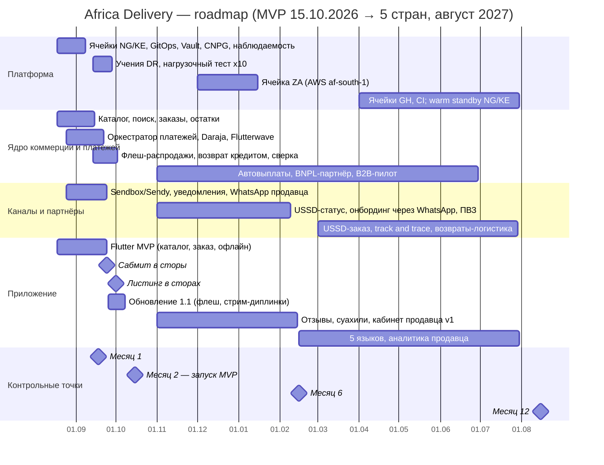
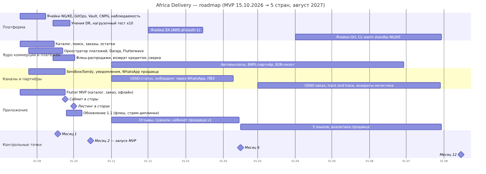

# Roadmap

Диаграмма: [roadmap.mmd](roadmap.mmd) → [roadmap.png](roadmap.png).

## Контрольные точки

| | **Месяц 1** (18.09.2026) | **Месяц 2 — MVP** (15.10.2026) | **Месяц 6** (15.02.2027) | **Месяц 12** (15.08.2027) |
|-|-|-|-|-|
| Scope | Ячейки NG/KE работают. Каталог (5 000 SKU), заказ, остатки. Платежи в sandbox: Daraja, Flutterwave, Paystack. Адаптеры Sendbox и Sendy. Уведомления. Приложение — внутренняя бета | **Запуск в Нигерии и Кении.** Приложение в сторах с 01.10. Оплата: M-Pesa, карта, перевод, наличные в Лагосе и Найроби. Флеш-распродажи. Отслеживание по статусам. Возврат кредитом на баланс. Подтверждение заказов продавцами в WhatsApp. Минимальный бэк-офис. Дашборд руководства. EN/FR. Opt-in через USSD/SMS | **ЮАР запущена** (ячейка в AWS af-south-1). Автоматические выплаты. USSD-статус и подтверждение. Онбординг продавца через WhatsApp. ПВЗ без видео. Отзывы (текст). Суахили. Кабинет продавца v1. Реферальные коды | **5 стран** (+ Гана, Кот-д'Ивуар). Track & trace, обратная логистика. USSD-заказ. 5 языков. Аналитика продавца. B2B-пилот. BNPL через партнёра. ML-антифрод (Buy). Видео в ПВЗ — если юрист разрешит. Warm standby NG/KE (99,95 %) |
| Команда | 6 контракторов (5 Go/Flutter + 1 SRE), CTO, архитектор | Те же 6. Дежурства с 01.10 ([team-structure](team-structure.md)) | 8: найм разморожен с января (A6, п. 5): +1 Go, +1 QA/поддержка | 11: 8 разработчиков, 2 SRE, 1 поддержка (FTE Года 2 по TCO A) |
| Инфраструктура (облако + SaaS) | ≈ $2 800/мес (prod ячейки + staging) | **$4 750/мес** ≤ $5 000 (A6, п. 1) | ≈ $6 500/мес: + ячейка ZA и рост. **Пересмотр лимита с CFO**: $5 000 действуют первые 6 месяцев (A6, п. 1) | ≈ $9 300/мес (TCO A, Год 2). Стоимость заказа ≈ $1,36 |
| Критерий «готово» | Тестовый заказ проходит end-to-end в sandbox в обеих странах | 99,9 % для пути заказа, 0 потерянных платежей, p75 до первого товара ≤ 2 с | Ячейка ZA развёрнута из того же шаблона без изменения кода | Новая страна — конфигурация + закупка площадки ≤ 4 недель |

## Что из 29 функций PM вошло в MVP и по какому критерию

**Критерий отбора** — функция попадает в MVP, только если выполнены все три условия:

1. **K1 или K2:** нужна для критерия успеха инвестора («люди покупают, продавцы получают деньги, ничего не ломается, данные в стране», A1) и целей MVP (K), **или** обещана в уже оплаченной рекламе (A2). Для обещаний допускается операционный обход.
2. **K3:** законна и не требует собственной лицензии (A3).
3. **K4:** помещается в ёмкость 48 человеко-недель и бюджет $5 000/мес. Из 48 пн на MVP распределено 44,5 пн, запас — 3,5 пн (~7 %).

Если функция не проходит K3, она отклоняется. Если проходит, но не помещается в K4, — переносится по ценности.

**Итог: 3 функции в MVP полностью, 7 — частично, 15 перенесены, 4 отклонены.**

| # | Функция A4 | Решение | Критерий |
|-|-|-|-|
| 16 | Флеш-распродажи, таймеры, резервирование | **MVP полностью** | K2 (A2: распродажа недели запуска), резервирование нужно для K1 |
| 26 | Бэк-офис: модерация, KYC, споры, возвраты | **MVP полностью** (минимальный, на конструкторе) | K1 + K2: без него не работают «проверено» и возвраты (C-11) |
| 28 | Дашборд руководства в реальном времени | **MVP полностью** (обновление раз в 1 мин) | K2 (A2), 1 пн |
| 1 | Каталог, неограниченные категории и атрибуты | MVP частично: атрибуты в JSONB с лимитами | K1. «Неограниченно» не нужно для 5 000 SKU |
| 2 | Поиск с опечатками на 5 языках | MVP частично: EN/FR, pg_trgm. 5 языков — месяц 12 | K1, K4 |
| 8 | Онбординг продавца только через WhatsApp | MVP частично: подтверждение заказов в WhatsApp, онбординг через операторов. Полностью — месяц 6 | K1 для 100 продавцов, K4 |
| 11 | Все способы оплаты | MVP частично: M-Pesa, карта, перевод. Наличные — только Лагос и Найроби | K1, K2 (обещание 3), ADR-004 |
| 18 | Трекинг, живая карта, ETA до минуты | MVP частично: статусы от партнёра. Карта — месяц 12 | K1. ETA зависит от данных партнёра |
| 20 | Возвраты 30 дней, деньги мгновенно | MVP частично: заявка + кредит на баланс мгновенно, деньги — после проверки | K2 (обещание 4) + K3 (без лицензии e-money, C-09) |
| 25 | PWA + нативные iOS и Android с паритетом | MVP частично: Flutter iOS + Android. PWA — не делаем | K1 (сторы), K4 (×3 к трудозатратам) |
| 10 | Кабинет продавца с аналитикой | Месяц 6 (v1), месяц 12 (когорты, прогноз) | K4 |
| 9 | Онбординг продавца через USSD | Месяц 12 | K4 |
| 24 | Офлайн-заказ через USSD/SMS | Месяц 6 (статус), месяц 12 (заказ) | K4. Обещание A2 сельским покупателям закрывается поэтапно |
| 7 | Отзывы с фото и видео | Месяц 6 (текст), месяц 12 (фото) | K4 |
| 23 | Партнёрская и реферальная программа | Месяц 6 (коды) | K4 |
| 29 | Тёмная тема | Месяц 6 | K4, ценность низкая |
| 19 | ПВЗ с видеофиксацией | Месяц 6 (ПВЗ), видео — после заключения юриста | K3 не подтверждён (A4, заметки) |
| 21 | ML-антифрод | Год 1 (Buy). На MVP — правила + скоринг PSP | K4: без истории данных ML не обучить |
| 22 | B2B: опт, счета, отсрочка 30 дней | Месяц 12 (пилот) | K4. Отсрочка — кредитный риск |
| 6 | Чат покупатель — продавец с автопереводом | Месяц 12 | K4 |
| 3 | Голосовой поиск на суахили и хауса | После Года 1 | K4, нет готовых моделей приемлемого качества |
| 4 | ИИ-рекомендации | После Года 1 | Без истории покупок нечего рекомендовать |
| 5 | Live-стрим с покупкой и чатом в приложении | Перенесено: стрим на внешней платформе + диплинки (обещание 7 закрыто операционно). Встроенный — после Года 1 | K2 закрыт иначе, K4 |
| 27 | Публичный GraphQL API | После Года 1 | Нет потребителей |
| 15 | «Колесо фортуны» | После Года 1 | Ни K1, ни K2 |
| 12 | Рассрочка со своим скорингом | **Отклонено.** Год 1 — BNPL через партнёра | K3: лицензия кредитования (C-06) |
| 13 | Мультивалютный кошелёк с P2P | **Отклонено** | K3: лицензия e-money (C-06) |
| 14 | Крипто-лояльность | **Отклонено.** Исследование после Года 1 | A1: «не к октябрю». Правовой статус токенов |
| 17 | Динамическое ценообразование по парсингу Jumia | **Отклонено** | K3: правовой риск парсинга, CEO — бывший сотрудник Jumia |

Утверждение «всё P0, инвестор был однозначен» (A4) опровергнуто самим инвестором: «бэк-офис подождёт», блокчейн «не к октябрю» (A1, C-10). Поэтому список A4 рассматривается как вход, а не как scope.

## Лестница сокращений, если отстаём

Решения приняты заранее, чтобы не спорить в последнюю неделю. Сокращаем сверху вниз:

1. Наличные курьеру → только Лагос.
2. Обновление 1.1 (флеш-механика) → флеш-цены без таймера.
3. Подтверждение заказов в WhatsApp → SMS со ссылкой.
4. FR-локализация → только EN.

Чего **не** сокращаем ни при каких условиях: оплата, сверка, идемпотентность, согласия, резидентность данных.

## Assumptions

- Временем отсчёта считается встреча в Найроби 18.08. Сабмит в сторы — 24.09, чтобы пройти ревью к 01.10.
- Страны Года 1: NG, KE, ZA, GH, CI ([ADR-004](adr-004-payment-provider.md)).
- Операторы бэк-офиса (по 1 на страну) — операционные сотрудники CEO, а не инженеры, и под заморозку найма инженеров не подпадают. Это нужно подтвердить у CFO ([risk-register](risk-register.md), R-07).
