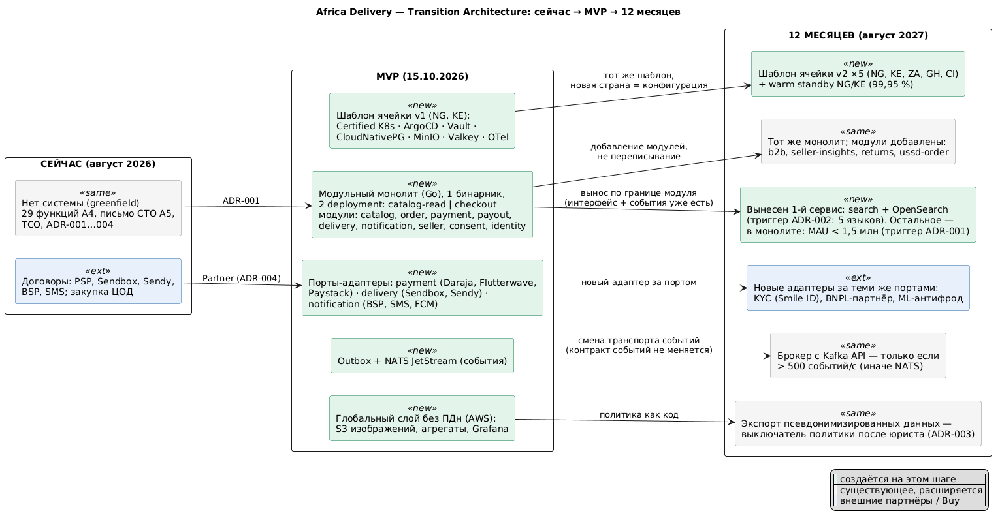

# Transition Architecture

Как MVP превращается в платформу на 5 стран **без переписывания**. Диаграмма: [transition-architecture.puml](transition-architecture.puml) -> [transition-architecture.png](transition-architecture.png).

## Состояния

| | **Сейчас** (август 2026) | **MVP** (15.10.2026) | **12 месяцев** (август 2027) |
|-|-|-|-|
| Страны | - | NG, KE | NG, KE, ZA, GH, CI |
| Стиль | Решение ADR-001 | Модульный монолит на Go: 1 бинарник, 2 deployment (`catalog-read`, `checkout`) | Тот же монолит + 1 выделенный сервис (поиск). MAU < 1,5 млн, поэтому дальнейший вынос не нужен (ADR-001) |
| Данные | Решение ADR-003 | Ячейки NG/KE у локальных провайдеров, PostgreSQL на ячейку, глобальный слой без ПДн | 5 ячеек: ZA, GH, CI - в hyperscaler или у локальных провайдеров по результату юридической проверки страны. Warm standby NG/KE |
| Интеграции | Договоры и KYC у PSP, Sendbox, Sendy, BSP, SMS | Порты `payment`, `delivery`, `notification` с адаптерами | Новые адаптеры: KYC (Smile ID), BNPL, ML-антифрод, PSP для GH/CI |
| События | - | Outbox + NATS JetStream | NATS. Брокер с Kafka API - только при > 500 событий/с |
| Доступность | - | 99,9 % (путь заказа) | 99,95 % (GMV >= $37 млн, [Task3](../Task3/availability-strategy.md)) |
| Команда | CTO, архитектор, 6 контракторов | 6 контракторов | 11 человек |
| Облако + SaaS | - | $4 750/мес | ≈ $9 300/мес |

## Что меняется на каждом шаге и почему без переписывания

| Шаг | Что меняется | Механизм, который это обеспечивает | Что **не** трогаем |
|-|-|-|-|
| Сейчас -> MVP | Создаётся всё | Модули с явными интерфейсами. Архитектурные тесты в CI запрещают модулям обращаться к таблицам друг друга | - |
| Новая страна (ZA, GH, CI) | Новая ячейка | **Шаблон ячейки** (Helm + ArgoCD ApplicationSet), политика резидентности как код ([ADR-003](../Task4/adr-003-data-residency.md)), маршруты PSP - конфигурация ([ADR-004](adr-004-payment-provider.md)) | Код приложения |
| Новый партнёр (KYC, BNPL, PSP, курьер) | Новый адаптер | **Порты и адаптеры**: модуль зависит от интерфейса `PaymentProvider`, `Carrier`, `KycProvider` | Модули-потребители |
| Новая функция (B2B, возвраты, аналитика продавца) | Новый модуль | Модуль подписывается на существующие события (`OrderPlaced`, `Delivered`) | Существующие модули |
| Вынос поиска в сервис | Модуль `catalog` отдаёт поиск отдельному деплою с OpenSearch | Интерфейс модуля + события `ProductUpdated` уже есть: сервис - их новый потребитель (паттерн strangler) | Вызывающий код меняет только адрес |
| Рост событий > 500/с | Транспорт событий: NATS -> Kafka API | Схема событий (CloudEvents) и outbox не зависят от транспорта | Издатели и подписчики |
| Ступень 99,95 % | Warm standby во втором ЦОДе | Тот же шаблон ячейки, другой профиль (`replicas`, `standby: true`) | Приложение |
| Свой dispatch-слой логистики (Год 2, по триггеру) | Новый адаптер `delivery` поверх курьерских партнёров | Порт `Carrier` ([capability-map](capability-map.md)) | Заказ и уведомления |
| Заключение юриста | Флаги экспорта данных | Политика OPA | Код |

## Что сознательно не входит в 12 месяцев

Микросервисы на 40–50 сервисов, Istio, мультирегион 99,99 %, Oracle, свой эквайринг. Каждое из этих решений имеет измеримый триггер (ADR-001, ADR-004, [Task3](../Task3/availability-strategy.md)) и **не требует переписывания**, когда триггер сработает. Письмо CTO (A5) остаётся целевым направлением.

## Assumptions

- MAU на конец Года 1 - около 400 тыс. ([tco-model](../Task2/tco-model.xlsx)). Триггер ADR-001 (MAU > 1,5 млн) ожидается в Году 2.
- Размещение ячеек GH и CI зависит от их законов о данных - отдельная юридическая проверка до выхода в страну.
